# Execution Plan

## Detailed Analysis Summary

### Change Impact Assessment
- **User-facing changes**: Yes — 4개 역할(임직원, 1차, 2차, 관리자)의 전용 화면 신규 구축
- **Structural changes**: Yes — 전체 시스템 아키텍처 신규 설계 (Frontend + Backend + AI + Infra)
- **Data model changes**: Yes — 티켓, 메시지, 사용자, 담당자, 피드백 등 전체 DB 스키마 신규 설계
- **API changes**: Yes — 모든 API 신규 설계
- **NFR impact**: Yes — 24/7 가용성, 5초 응답, 보안(SECURITY rules 전체 적용)

### Risk Assessment
- **Risk Level**: High (전체 시스템 신규 구축, AI 통합, 5개 유닛 병렬 개발)
- **Rollback Complexity**: N/A (Greenfield)
- **Testing Complexity**: Complex (AI 응답 품질, 이메일 파싱, 역할 기반 접근 제어)

---

## Workflow Visualization

```mermaid
flowchart TD
    Start(["User Request"])
    
    subgraph INCEPTION["🔵 INCEPTION PHASE"]
        WD["Workspace Detection<br/><b>COMPLETED</b>"]
        RA["Requirements Analysis<br/><b>COMPLETED</b>"]
        US["User Stories<br/><b>COMPLETED</b>"]
        WP["Workflow Planning<br/><b>COMPLETED</b>"]
        AD["Application Design<br/><b>EXECUTE</b><br/>(+ DB 모델링 초안)"]
        UG["Units Generation<br/><b>EXECUTE</b>"]
    end
    
    subgraph CONSTRUCTION["🟢 CONSTRUCTION PHASE"]
        FD["Functional Design<br/><b>EXECUTE</b><br/>(per-unit)"]
        NFRA["NFR Requirements<br/><b>EXECUTE</b><br/>(per-unit)"]
        NFRD["NFR Design<br/><b>EXECUTE</b><br/>(per-unit)"]
        ID["Infrastructure Design<br/><b>EXECUTE</b><br/>(per-unit)"]
        CG["Code Generation<br/><b>EXECUTE</b><br/>(per-unit)"]
        BT["Build and Test<br/><b>EXECUTE</b>"]
    end
    
    Start --> WD
    WD --> RA
    RA --> US
    US --> WP
    WP --> AD
    AD --> UG
    UG --> FD
    FD --> NFRA
    NFRA --> NFRD
    NFRD --> ID
    ID --> CG
    CG -.->|Next Unit| FD
    CG --> BT
    BT --> End(["Complete"])
    
    style WD fill:#4CAF50,stroke:#1B5E20,stroke-width:3px,color:#fff
    style RA fill:#4CAF50,stroke:#1B5E20,stroke-width:3px,color:#fff
    style US fill:#4CAF50,stroke:#1B5E20,stroke-width:3px,color:#fff
    style WP fill:#4CAF50,stroke:#1B5E20,stroke-width:3px,color:#fff
    style AD fill:#FFA726,stroke:#E65100,stroke-width:3px,stroke-dasharray: 5 5,color:#000
    style UG fill:#FFA726,stroke:#E65100,stroke-width:3px,stroke-dasharray: 5 5,color:#000
    style FD fill:#FFA726,stroke:#E65100,stroke-width:3px,stroke-dasharray: 5 5,color:#000
    style NFRA fill:#FFA726,stroke:#E65100,stroke-width:3px,stroke-dasharray: 5 5,color:#000
    style NFRD fill:#FFA726,stroke:#E65100,stroke-width:3px,stroke-dasharray: 5 5,color:#000
    style ID fill:#FFA726,stroke:#E65100,stroke-width:3px,stroke-dasharray: 5 5,color:#000
    style CG fill:#FFA726,stroke:#E65100,stroke-width:3px,stroke-dasharray: 5 5,color:#000
    style BT fill:#4CAF50,stroke:#1B5E20,stroke-width:3px,color:#fff
    style INCEPTION fill:#BBDEFB,stroke:#1565C0,stroke-width:3px,color:#000
    style CONSTRUCTION fill:#C8E6C9,stroke:#2E7D32,stroke-width:3px,color:#000
    style Start fill:#CE93D8,stroke:#6A1B9A,stroke-width:3px,color:#000
    style End fill:#CE93D8,stroke:#6A1B9A,stroke-width:3px,color:#000
    
    linkStyle default stroke:#333,stroke-width:2px
```



### Text Alternative
```
Phase 1: INCEPTION
  - Workspace Detection (COMPLETED)
  - Requirements Analysis (COMPLETED)
  - User Stories (COMPLETED)
  - Workflow Planning (COMPLETED)
  - Application Design + DB 모델링 초안 (EXECUTE)
  - Units Generation (EXECUTE)

Phase 2: CONSTRUCTION (per-unit x 5)
  - Functional Design (EXECUTE, per-unit)
  - NFR Requirements (EXECUTE, per-unit)
  - NFR Design (EXECUTE, per-unit)
  - Infrastructure Design (EXECUTE, per-unit)
  - Code Generation (EXECUTE, per-unit)
  - Build and Test (EXECUTE, after all units)
```

---

## Phases to Execute

### 🔵 INCEPTION PHASE
- [x] Workspace Detection (COMPLETED)
- [x] Requirements Analysis (COMPLETED)
- [x] User Stories (COMPLETED)
- [x] Workflow Planning (COMPLETED)
- [ ] Application Design - **EXECUTE**
  - **Rationale**: 전체 시스템 신규 구축. 컴포넌트 식별, 서비스 레이어 설계, **DB 모델링 초안(ERD)** 포함. 유닛 간 충돌 방지를 위해 INCEPTION에서 DB 구조 확정.
- [ ] Units Generation - **EXECUTE**
  - **Rationale**: 5개 유닛으로 분할 개발 필요. 유닛 간 의존성, 인터페이스 경계 정의.

### 🟢 CONSTRUCTION PHASE (Per-Unit Loop x 5)
- [ ] Functional Design - **EXECUTE** (per-unit)
  - **Rationale**: 각 유닛별 상세 비즈니스 로직, DB 스키마 상세화, API 설계
- [ ] NFR Requirements - **EXECUTE** (per-unit)
  - **Rationale**: 24/7 가용성, 보안(SECURITY rules), 성능 요구사항 존재
- [ ] NFR Design - **EXECUTE** (per-unit)
  - **Rationale**: NFR 패턴 적용 (인증, 암호화, 로깅, Rate Limiting 등)
- [ ] Infrastructure Design - **EXECUTE** (per-unit)
  - **Rationale**: AWS 인프라 설계 필요 (Terraform). 각 유닛별 인프라 리소스 매핑.
- [ ] Code Generation - **EXECUTE** (per-unit, ALWAYS)
  - **Rationale**: 코드 구현 필수
- [ ] Build and Test - **EXECUTE** (ALWAYS, after all units)
  - **Rationale**: 전체 빌드 및 통합 테스트

---

## Unit 구성 (5개)

| # | Unit | 주요 역할 | 담당 Epic |
|---|---|---|---|
| 1 | **Frontend** | React/Next.js 전체 UI | Epic 1, 2, 3(UI), 4(UI), 6, 7(UI) |
| 2 | **Intake & Routing** | 문의 접수 API, 이메일 파싱, 티켓 식별, 분배 엔진 | Epic 3, 4, 5 |
| 3 | **AI/RAG** | Bedrock+KB, LLM 라우팅, 답변 생성, 합성 데이터 | Epic 1(AI), 9 |
| 4 | **Admin & Analytics** | 인증, 통계, 대시보드, 부서/담당자 관리 | Epic 6, 7, 8 |
| 5 | **Infrastructure** | Terraform IaC, SES, 피드백 파이프라인, KB 재색인 | 전체 인프라 |

---

## Application Design에서 포함할 내용
- 전체 시스템 아키텍처 다이어그램
- 컴포넌트/서비스 식별 및 책임 정의
- **전체 DB 모델링 초안 (ERD)**
  - 테이블 목록 및 주요 컬럼
  - 테이블 간 관계 (FK)
  - 유닛별 테이블 소유권 명시
- API 인터페이스 경계 (유닛 간 통신)
- 이벤트/메시지 흐름

---

## Success Criteria
- **Primary Goal**: AI 기반 IT Help Desk MVP 구축 (1차 해결률 70%+, 분배 성공률 90%+)
- **Key Deliverables**: 
  - 임직원/처리자/관리자 웹 화면
  - AI 자동 응답 + 분배 백엔드
  - 이메일 인바운드/아웃바운드
  - 관리자 대시보드 + LLM 비용 통계
  - 합성 데이터 10만 건 생성
  - AWS 인프라 (Terraform)
- **Quality Gates**: 
  - SECURITY rules 전체 준수
  - 단위/통합 테스트 통과
  - Public/Private 메시지 격리 검증

### 🟡 OPERATIONS PHASE
- [ ] Operations - PLACEHOLDER
  - **Rationale**: 향후 배포/모니터링 워크플로우 확장 예정

---

## Merge Strategy: 충돌 최소화 전략

### 실행 방식: Option C (설계 통합 → 코드 유닛별)

```
Application Design (전체 통합 설계)
  ├─ 시스템 아키텍처
  ├─ DB 모델링 초안 (ERD) + 유닛별 테이블 소유권
  ├─ API 인터페이스 계약 (유닛 간 통신 규약)
  └─ 디렉토리 구조 + 모듈 경계 확정
        ↓
Units Generation (유닛 분할 + 의존성 정의)
        ↓
Construction: 설계 일괄 (5유닛 한번에)
  ├─ Functional Design (5유닛 통합)
  ├─ NFR Requirements (5유닛 통합)
  ├─ NFR Design (5유닛 통합)
  └─ Infrastructure Design (5유닛 통합)
        ↓
Construction: 코드 유닛별 순차
  ├─ Code Gen: Unit 1 (Frontend)
  ├─ Code Gen: Unit 2 (Intake & Routing)
  ├─ Code Gen: Unit 3 (AI/RAG)
  ├─ Code Gen: Unit 4 (Admin & Analytics)
  └─ Code Gen: Unit 5 (Infrastructure)
        ↓
Build and Test (통합 빌드 + 테스트)
```

### 충돌 방지 원칙

1. **디렉토리 격리**: 각 유닛은 독립 디렉토리에서 작업. 파일 수준 충돌 원천 차단.
   ```
   /src
     /frontend/        ← Unit 1 전용
     /intake-routing/  ← Unit 2 전용
     /ai-rag/          ← Unit 3 전용
     /admin-analytics/ ← Unit 4 전용
   /infra/             ← Unit 5 전용
   /shared/            ← 공유 타입/인터페이스 (Application Design에서 확정)
   ```

2. **공유 계약 선확정**: Application Design에서 다음을 확정하여 유닛 간 의존성 제거
   - DB 스키마 (테이블 소유권 명시)
   - API 인터페이스 (OpenAPI 스펙)
   - 공유 타입/DTO 정의
   - 이벤트/메시지 포맷

3. **단방향 의존**: 유닛 간 의존은 공유 인터페이스를 통해서만. 직접 import 금지.

4. **머지 순서**: 
   - shared/ 먼저 → infra/ → backend 유닛들 → frontend 순서
   - 각 유닛은 독립 빌드 가능하도록 설계

5. **통합 테스트**: Build and Test에서 전체 통합 검증. 유닛별 단위 테스트는 Code Gen에서 포함.
